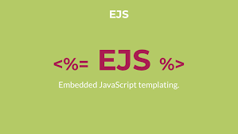

---

### Table of Contents

- [Description](#description)
- [How To Use](#how-to-use)
- [References](#references)
- [License](#license)
- [Contributors info](#contributor-info)

---

## Description

Development of a simplified clone of Twitter in Node.js with a MySQL database that stores the data, while respecting the MVC architecture and including JWT authentication.

#### Technologies

<div>


  <!-- 
    
    
    
    
    
    
     -->

</div>

[Back To The Top](#read-me-template)

---

## How To Use

#### Installation

#### API Reference

```html
<p>dummy code</p>
```

[Back To The Top](#read-me-template)

---

## References

[Back To The Top](#read-me-template)

<!-- --- -->

<!-- ## License -->

[Back To The Top](#read-me-template)

---

## Contributors

- Kanu Rebecca - [Github](https://img.shields.io/badge/GitHub-100000?style=for-the-badge&logo=github&logoColor=white)
  [Back To The Top](#read-me-template)

<br />
<br />

[github]: https://github.com/RebeccaRamalho
