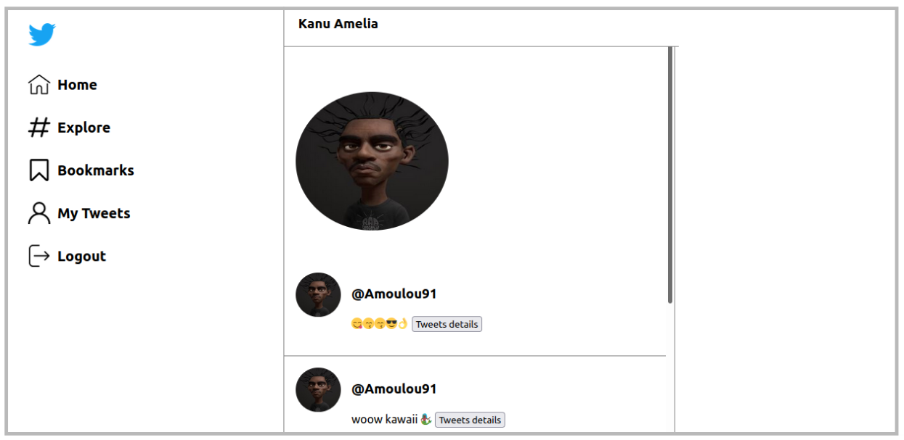

# 🚀 Twitter Clone

  

---

### Table of Contents

- [Description](#description)
- [How To Use](#how-to-use)
- [References](#references)
- [Contributors info](#contributors)

---

## 📖 Description

Development of a simplified clone of Twitter in Node.js with a MySQL database, while respecting the MVC architecture and including JWT authentication.

#### 🔬Technologies

---

## How To Use

#### ⚙️ Installation

1.  Installation of Nodejs

            sudo apt install nodejs

2.  Initialisation of a package.json

            npm init

3.  Installation of modules

            npm install express
            npm install -D nodemon
            npm install mysql2
            npm install dotenv
            npm install body-parser
            npm install cookie-parser
            npm install cors
            npm install jsonwebtoken
            npm install bcrypt
            npm install ejs
            npm install express-session
            npm install express-flash-message
            npm install express fileupload

---

#### API Reference

---

## References

<!-- --- -->

<!-- ## License -->

---

## Contributors

- <spam>Kanu Rebecca</spam> [][github]

 
 

[github]: https://github.com/RebeccaRamalho
